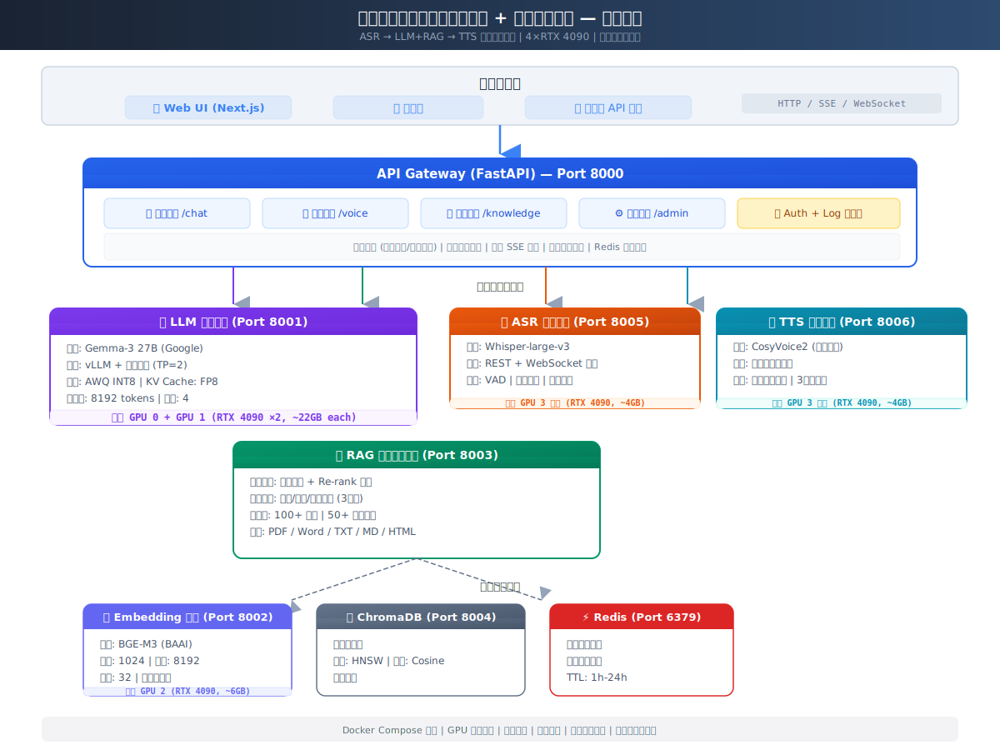

# 智能知识库 — 企业内部知识库问答系统 + 语音对话助手

面向企业的**内部知识库问答系统**，支持文本和语音两种交互方式。采用 **ASR → LLM+RAG → TTS** 三阶段流水线架构，**数据不出企业、完全私有化部署**。



---

## 核心特性

| 特性 | 说明 |
|------|------|
| 🔒 **私有化部署** | 所有模型和数据部署在企业内部服务器，数据安全可控 |
| 📚 **RAG 知识问答** | 基于检索增强生成，精准回答私域知识 |
| 🎤 **语音交互** | 全链路语音对话：录音 → ASR → LLM+RAG → TTS |
| 🏭 **行业深度定制** | 行业术语词典、同义词映射、行业专用 System Prompt，支持自定义配置 |
| 🖥️ **多 GPU 优化** | 4×RTX 4090 精确分配，张量并行 + INT8 量化 |
| 📦 **一键部署** | Docker Compose 编排，GPU 绑定，健康检查，异常自动重启 |
| 💬 **多轮对话** | 上下文记忆、指代消解、对话历史管理 |
| 🌊 **流式响应** | SSE 打字机效果逐字返回，体验流畅 |

## 系统架构

```
用户交互层:  Web UI (Next.js)  |  移动端  |  第三方 API
                │  HTTP / SSE / WebSocket
     ┌──────────▼──────────────────────────┐
     │     API Gateway (FastAPI) :8000     │
     │  对话路由 | 语音路由 | 知识路由 | 管理路由  │
     │  对话管理 | 指代消解 | 鉴权 | 日志       │
     └───┬─────────┬─────────┬─────────┬───┘
         │         │         │         │
    ┌────▼──┐ ┌───▼───┐ ┌───▼───┐ ┌───▼───┐
    │  LLM  │ │  RAG  │ │  ASR  │ │  TTS  │
    │:8001  │ │ :8003 │ │ :8005 │ │ :8006 │
    │Gemma3 │ │检索+  │ │Whisper│ │CosyV2 │
    │GPU0,1 │ │重排序 │ │ GPU:3 │ │ GPU:3 │
    └───────┘ └───┬───┘ └───────┘ └───────┘
                  │
         ┌────────▼────────┐
         │  数据与存储层    │
         │ ChromaDB │ Redis │
         │ :8004    │ :6379 │
         │ BGE-M3 Emb :8002│
         │ GPU:2            │
         └─────────────────┘
```

## 技术栈

| 组件 | 技术 | 说明 |
|------|------|------|
| 语音识别 | **Whisper-large-v3** (OpenAI) | 中英混合，流式解码，VAD 语音检测 |
| 语言模型 | **Gemma-3 27B** (Google) | vLLM 推理引擎，2×GPU 张量并行，INT8 量化 |
| 向量化 | **BGE-M3** (BAAI) | 8192 token 长文本，1024 维输出 |
| 语音合成 | **CosyVoice2** (阿里通义) | 零样本音色克隆，流式分句合成 |
| 向量数据库 | **ChromaDB** | HNSW 索引，轻量级私有化部署 |
| API 网关 | **FastAPI** (Python) | 异步高性能，SSE 流式，WebSocket |
| 前端 | **Next.js 14** | React 服务端组件，Tailwind CSS |
| 容器编排 | **Docker Compose** | GPU 精确绑定，服务互联，健康检查 |
| 缓存 | **Redis** | 对话历史 + 检索缓存 |

## GPU 分配

| GPU | 服务 | 模型 | 显存占用 |
|-----|------|------|---------|
| GPU 0,1 | LLM Service | Gemma-3 27B (TP=2) | ~22GB ×2 |
| GPU 2 | Embedding Service | BGE-M3 | ~6GB |
| GPU 3 | ASR + TTS | Whisper-v3 + CosyVoice2 | ~4GB + ~4GB |

## 快速开始

### 环境要求

- Ubuntu 22.04+ / WSL2
- NVIDIA Driver 535+ + CUDA 12.4
- Docker 24+ + Docker Compose 2.20+
- NVIDIA Container Toolkit
- 4×RTX 4090 (24GB) 或等效 GPU

### 一键部署

```bash
# 1. 克隆项目
cd aigic

# 2. 一键部署（检查依赖 → 初始化 → 下载模型 → 构建 → 启动 → 导入示例数据）
bash scripts/setup.sh all

# 3. 访问
# API 文档: http://localhost:8000/docs
# 前端界面: http://localhost:3000
```

### 分步部署

```bash
# Step 1: 环境初始化
make setup
make init-dirs

# Step 2: 下载模型（自动选择国内镜像: ModelScope > HF Mirror）
make download-models
# 或下载指定模型:
make download-model-embedding   # BGE-M3 (~2GB)
make download-model-llm         # Gemma-3 (~50GB)
make download-model-whisper     # Whisper (~3GB)
make download-model-tts         # CosyVoice2 (~2GB)

# Step 3: 构建并启动
make build
make start-core     # Redis + ChromaDB + LLM + Embedding
# 等待 LLM 服务就绪 (~2 分钟)
make start-voice    # ASR + TTS
make start-api      # RAG + API Gateway + Frontend

# Step 4: 导入知识库
make kb-ingest

# Step 5: 检查状态
make status
make health
```

### 模型下载（国内镜像）

项目已配置国内模型下载镜像源，自动选择最佳源：

| 镜像源 | URL | 优先级 |
|--------|-----|--------|
| ModelScope | https://modelscope.cn | 1 (最快) |
| HF Mirror | https://hf-mirror.com | 2 |
| HuggingFace | https://huggingface.co | 3 (需代理) |

```bash
# 检测最佳镜像源
make detect-mirror

# 下载所有模型 (~57GB)
make download-models
```

## 项目结构

```
aigic/
├── README.md                        # 项目文档
├── docker-compose.yml               # 8 个服务容器编排
├── .env.example                     # 60+ 环境变量模板
├── Makefile                         # 30+ 常用命令
│
├── docs/                            # 文档
│   ├── architecture.md              # 架构设计文档
│   ├── architecture.svg             # 架构图 (SVG)
│   ├── api-spec.md                  # API 接口规范 (20+ 接口)
│   ├── deployment.md                # 部署运维手册
│   └── functional-spec.md           # 功能规格与开发完成报告
│
├── services/                        # 微服务层 (6 个服务)
│   ├── api-gateway/                 # API 网关 (FastAPI)
│   │   ├── app/routers/             # chat / voice / knowledge / admin
│   │   ├── app/services/            # LLM/RAG/ASR/TTS 客户端 + 对话管理
│   │   └── app/middleware/           # JWT 鉴权 + 请求日志
│   ├── llm-service/                 # LLM 推理 (Gemma-3 + vLLM)
│   ├── embedding-service/           # Embedding (BGE-M3)
│   ├── rag-service/                 # RAG 检索增强
│   │   ├── app/retrieval/           # 检索/重排序/同义词
│   │   └── app/indexing/            # 分段引擎/入库流水线
│   ├── asr-service/                 # 语音识别 (Whisper)
│   └── tts-service/                 # 语音合成 (CosyVoice2)
│
├── frontend/                        # Web UI (Next.js 14)
│   └── src/components/              # Chat/Voice/Knowledge/Layout
│
├── knowledge-base/                  # 知识库管理工具
│   ├── dicts/                       # 行业术语词典 + 同义词映射
│   ├── scripts/                     # 导入/批量/增量更新脚本
│   └── sample-docs/                 # 示例文档目录
│
├── scripts/                         # 运维脚本
│   ├── setup.sh                     # 一键部署
│   ├── download_models.sh           # 模型下载 (国内镜像)
│   ├── health_check.sh              # 健康检查
│   └── benchmark.sh                 # 性能压测
│
└── tests/                           # 测试
    ├── test_rag_flow.py             # RAG 流程测试 (12 用例)
    └── test_api_gateway.py          # API 网关测试 (12 用例)
```

## API 接口

### 对话

```bash
# 文本问答 (流式 SSE)
curl -X POST http://localhost:8000/api/v1/chat/stream \
  -H "Content-Type: application/json" \
  -d '{"message": "服务器的巡检项目有哪些？", "stream": true}'

# 文本问答 (非流式)
curl -X POST http://localhost:8000/api/v1/chat \
  -H "Content-Type: application/json" \
  -d '{"message": "数据安全分级的级别有哪些？"}'

# 获取对话列表
curl http://localhost:8000/api/v1/conversations
```

### 语音

```bash
# 语音识别
curl -X POST http://localhost:8000/api/v1/voice/transcribe \
  -F "audio=@recording.wav"

# 语音合成
curl -X POST "http://localhost:8000/api/v1/voice/synthesize?text=你好&voice_id=default" \
  --output reply.wav

# 语音对话 (ASR→LLM→TTS 全链路)
curl -X POST http://localhost:8000/api/v1/voice/chat \
  -F "audio=@question.wav" -F "voice_id=default" \
  --output answer.wav
```

### 知识库

```bash
# 语义搜索
curl "http://localhost:8000/api/v1/knowledge/search?query=服务器维护&top_k=5"

# 上传文档
curl -X POST http://localhost:8000/api/v1/knowledge/upload \
  -F "file=@操作手册.pdf"

# 知识库统计
curl http://localhost:8000/api/v1/knowledge/stats
```

### 管理

```bash
# 全局健康检查
curl http://localhost:8000/api/v1/admin/health

# 获取 JWT Token
curl -X POST "http://localhost:8000/api/v1/admin/auth/token?username=admin&password=admin"
```

完整 API 文档: http://localhost:8000/docs (Swagger UI)

## 知识库管理

### 导入文档

```bash
# 批量导入
python knowledge-base/scripts/batch_import.py --input-dir /path/to/docs

# 单目录导入
python knowledge-base/scripts/ingest.py --docs-dir /path/to/doc

# 增量更新（仅处理变更文件）
python knowledge-base/scripts/update.py --docs-dir /path/to/docs
```

### 自定义行业词典

编辑 `knowledge-base/dicts/energy_terms.txt` 添加行业术语（一行一词）。

编辑 `knowledge-base/dicts/synonyms.yaml` 添加同义词映射：
```yaml
服务器:
  - 主机
  - Server
  - 计算节点
```

## 常用命令

```bash
make help          # 显示所有命令
make build         # 构建镜像
make start         # 启动所有服务
make stop          # 停止所有服务
make restart       # 重启所有服务
make logs          # 查看日志
make status        # 查看状态
make health        # 健康检查
make test          # 运行测试
make kb-ingest     # 导入知识库
make benchmark     # 性能测试
make clean         # 清理容器和卷
```

## 性能目标

| 环节 | 目标延迟 | 优化手段 |
|------|---------|---------|
| ASR 首字 | < 200ms | faster-whisper + VAD 过滤 |
| LLM 推理 | < 1.5s | TP=2, INT8, KV Cache FP8 |
| TTS 首包 | < 300ms | 流式分句合成 |
| 文本问答 E2E | < 3s | 检索缓存 + 并发控制 |
| 语音问答 E2E | < 5s | 全链路异步 |

## 文档索引

| 文档 | 说明 |
|------|------|
| [架构设计](docs/architecture.md) | 系统架构、数据流、服务接口、部署架构 |
| [API 规范](docs/api-spec.md) | 20+ API 接口详细说明 |
| [部署手册](docs/deployment.md) | 环境要求、部署步骤、运维操作、备份恢复 |
| [功能规格](docs/functional-spec.md) | 模块功能规格、开发完成报告 (100 文件清单) |
| [架构图](docs/architecture.svg) | 系统架构 SVG 图 |

## 生产环境注意事项

1. **修改默认密码**：`.env` 中的 `JWT_SECRET_KEY` 和 Redis 密码
2. **启用鉴权**：设置 `ENVIRONMENT=production`
3. **配置 HTTPS**：前置 Nginx 反向代理 + Let's Encrypt
4. **日志收集**：配置 Docker 日志驱动或 ELK/Loki
5. **GPU 监控**：nvidia-smi + Prometheus + Grafana
6. **定期备份**：ChromaDB 卷和 Redis 数据
7. **SSO 对接**：替换默认 `admin/admin` 为企业 LDAP/OAuth

## License

内部项目，保留所有权利。
